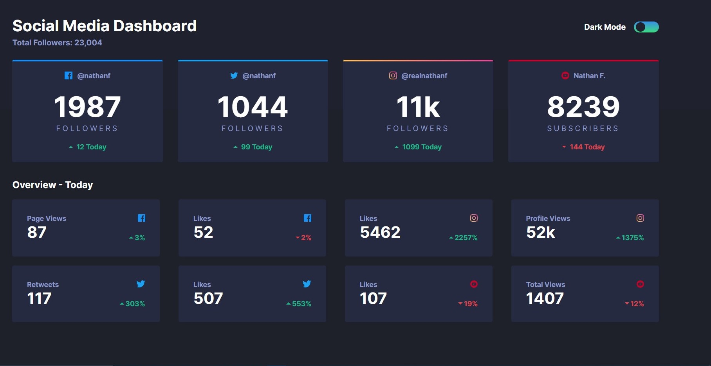

# Frontend Mentor - Social media dashboard with theme switcher solution

This is a solution to the [Social media dashboard with theme switcher challenge on Frontend Mentor](https://www.frontendmentor.io/challenges/social-media-dashboard-with-theme-switcher-6oY8ozp_H). Frontend Mentor challenges help you improve your coding skills by building realistic projects.

## Table of contents

- [Overview](#overview)
  - [The challenge](#the-challenge)
  - [Screenshot](#screenshot)
  - [Links](#links)
- [My process](#my-process)
  - [Built with](#built-with)
  - [What I learned](#what-i-learned)
  - [Continued development](#continued-development)
  - [Useful resources](#useful-resources)
- [Author](#author)
- [Acknowledgments](#acknowledgments)

## Overview

### The challenge

Users should be able to:

- View the optimal layout for the site depending on their device's screen size
- See hover states for all interactive elements on the page
- Toggle color theme to their preference

### Screenshot

### Links

- Solution URL: [https://github.com/Adrian-py/Frontend-Mentor----Social-media-dashboard-with-theme-switcher-challenge-hub](https://github.com/Adrian-py/Frontend-Mentor----Social-media-dashboard-with-theme-switcher-challenge-hub)
- Live Site URL: [https://adrian-py.github.io/Frontend-Mentor----Social-media-dashboard-with-theme-switcher-challenge-hub/](https://adrian-py.github.io/Frontend-Mentor----Social-media-dashboard-with-theme-switcher-challenge-hub/)

## My process

### Built with

- Semantic HTML5 markup
- CSS custom properties
- Flexbox
- CSS Grid
- Mobile-first workflow
- Sass preprocessor

### What I learned

Throughout doing this project I started to use Sass. I learned to seperate my sass files into modules and seperate them more into different categories such as components, globals, and utilities. I learned to use mixins and functions in sass to make media queries and automatically transforming px to rems. I also researched a bit more into the 'aria' tag and accesibility for a website.

### Continued development

For future projects, I would like to try out using a gulp workflow combined with css nano. Another thing I want to do is to create a lot of projects using REACT or other frameworks. One last thing that I want to improve on is a bit of backend knowledge, like working with APIs and Javascript.

### Useful resources

- [Coder Coder Youtube Video](https://www.youtube.com/watch?v=iL4irerdGdU&t=3s) - Through this video I used some of the techniques that is shown in the video
- [MDN Web Docs](https://developer.mozilla.org/en-US/docs/Web/CSS/@media/prefers-color-scheme) - I also researched a bit about prefers color scheme and what it is

## Author

- Frontend Mentor - [@Adrian-py](https://www.frontendmentor.io/profile/Adrian-py)
- Github - [@Adrian-py](https://github.com/Adrian-py)

## Acknowledgments

I really want to credit [Coder Coder](https://www.youtube.com/channel/UCzNf0liwUzMN6_pixbQlMhQ), as I really took a lot of techniques and methods from her solution and is just really impressed on how she works through this particular project.
