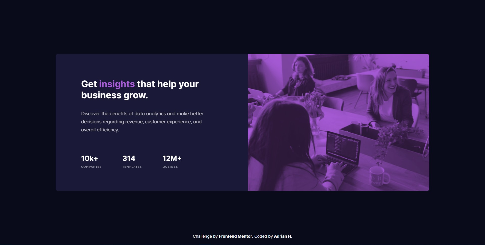

# Frontend Mentor - Stats preview card component solution

This is a solution to the [Stats preview card component challenge on Frontend Mentor](https://www.frontendmentor.io/challenges/stats-preview-card-component-8JqbgoU62). Frontend Mentor challenges help you improve your coding skills by building realistic projects.

## Table of contents

- [Overview](#overview)
  - [The challenge](#the-challenge)
  - [Screenshot](#screenshot)
  - [Links](#links)
- [My process](#my-process)
  - [Built with](#built-with)
  - [What I learned](#what-i-learned)
  - [Continued development](#continued-development)
  - [Useful resources](#useful-resources)
- [Author](#author)

## Overview

### The challenge

Users should be able to:

- View the optimal layout depending on their device's screen size

### Screenshot

### Links

- Solution URL: [Add solution URL here](https://github.com/Adrian-py/Frontend-Mentor---stats-preview-card-component-challenge-hub)
- Live Site URL: [Add live site URL here](https://adrian-py.github.io/Frontend-Mentor---stats-preview-card-component-challenge-hub/)

## My process

### Built with

- Semantic HTML5 markup
- CSS custom properties
- Flexbox
- BEM Naming Convention
- Responsive Design
- Desktop-first workflow

### What I learned

In this project I learned to use the BEM naming convention and further improve the responsiveness of the websites I build.

### Continued development

For future projects I plan to continue learning about CSS and further my knowledge on accesibility, as I have struggled before in understanding certain accesibility concepts.

### Useful resources

- Stackoverflow - (https://stackoverflow.com)
- MDN - (https://developer.mozilla.org/en-US/)
- Accesibility - (https://medium.com/capital-one-tech/building-accessible-front-ends-298c03e5bd86)

## Author

- Github - [Adrian-py](https://github.com/Adrian-py)
- Frontend Mentor - [@Adrian-py](https://www.frontendmentor.io/profile/Adrian-py)
