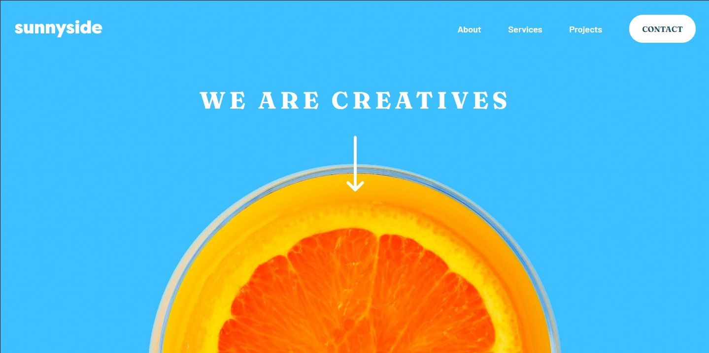

# Frontend Mentor - Sunnyside agency landing page solution

This is a solution to the [Sunnyside agency landing page challenge on Frontend Mentor](https://www.frontendmentor.io/challenges/sunnyside-agency-landing-page-7yVs3B6ef). Frontend Mentor challenges help you improve your coding skills by building realistic projects.

## Table of contents

- [Overview](#overview)
  - [The challenge](#the-challenge)
  - [Screenshot](#screenshot)
  - [Links](#links)
- [My process](#my-process)
  - [Built with](#built-with)
  - [What I learned](#what-i-learned)
  - [Continued development](#continued-development)
  - [Useful resources](#useful-resources)
- [Author](#author)

**Note: Delete this note and update the table of contents based on what sections you keep.**

## Overview

### The challenge

The challenge is to create a website based on a template that is given.

Users should be able to:

- View the optimal layout for the site depending on their device's screen size
- See hover states for all interactive elements on the page

### Screenshot

### Links

- Solution URL: [https://github.com/Adrian-py/FrontendMentor---Sunnyside-agency-landing-page](https://github.com/Adrian-py/FrontendMentor---Sunnyside-agency-landing-page)
- Live Site URL: [https://adrian-py.github.io/FrontendMentor---Sunnyside-agency-landing-page/](https://adrian-py.github.io/FrontendMentor---Sunnyside-agency-landing-page/)

## My process

### Built with

- Semantic HTML5 markup
- CSS custom properties
- Flexbox
- CSS Grid
- Desktop-first workflow

### What I learned

Through out the challenge I really refined certain techniques that I usually used, and had some realizations on better techniques that I could have used for certain areas or use cases.

### Continued development

Layouting is one area that I personally want to impove on even more, as I feel like my current techniques and style in layouting is not very elegant and is sometimes quite messy.

### Useful resources

- [w3school.com](https://www.w3schools.com/) - This helped me in refreshing my memory for certain syntax
- [CSS Tricks](https://css-tricks.com/) -Through this website I learned more about gridbox in css and implemented it in this challenge

## Author

- Frontend Mentor - [@Adrian-py](https://www.frontendmentor.io/profile/Adrian-py)
