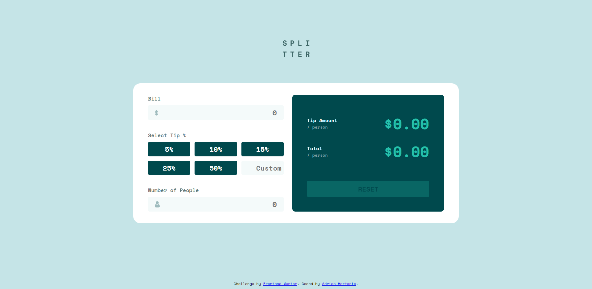

# Frontend Mentor - Tip calculator app solution

This is a solution to the [Tip calculator app challenge on Frontend Mentor](https://www.frontendmentor.io/challenges/tip-calculator-app-ugJNGbJUX). Frontend Mentor challenges help you improve your coding skills by building realistic projects.

## Table of contents

- [Overview](#overview)
  - [The challenge](#the-challenge)
  - [Screenshot](#screenshot)
  - [Links](#links)
- [My process](#my-process)
  - [Built with](#built-with)
  - [What I learned](#what-i-learned)
  - [Continued development](#continued-development)
  - [Useful resources](#useful-resources)
- [Author](#author)
- [Acknowledgments](#acknowledgments)

## Overview

### The challenge

Users should be able to:

- View the optimal layout for the app depending on their device's screen size
- See hover states for all interactive elements on the page
- Calculate the correct tip and total cost of the bill per person

### Screenshot



### Links

- Solution URL: [https://github.com/Adrian-py/Tip-Calculator---FEM](https://github.com/Adrian-py/Tip-Calculator---FEM)
- Live Site URL: [https://adrian-py.github.io/Tip-Calculator---FEM/](https://adrian-py.github.io/Tip-Calculator---FEM/)

## My process

### Built with

- Semantic HTML5 markup
- Flexbox
- CSS Grid
- SASS
- Javascript
- Mobile-first workflow

### What I learned

Throughout doing this project, I actually learned quite a lot about javascript. Like for example, I learnt about how to make a form without using a submit button, like so:

```js
form.addEventListener("change", () => {});
```

### Continued development

Several areas that I want to focus on for future projects are accesibility for websites, javascript, React, and many more.

### Useful resources

- [w3school](https://www.w3schools.com/) - This helped me a lot of syntaxes that I forgot and previously did not know about.

## Author

- Frontend Mentor - [@Adrian-py](https://www.frontendmentor.io/profile/Adrian-py)
- Github - [@Adrian-py](https://github.com/Adrian-py)

## Acknowledgments

For this project I did not really had any other person's help, but I did use a lot of other external resources.
